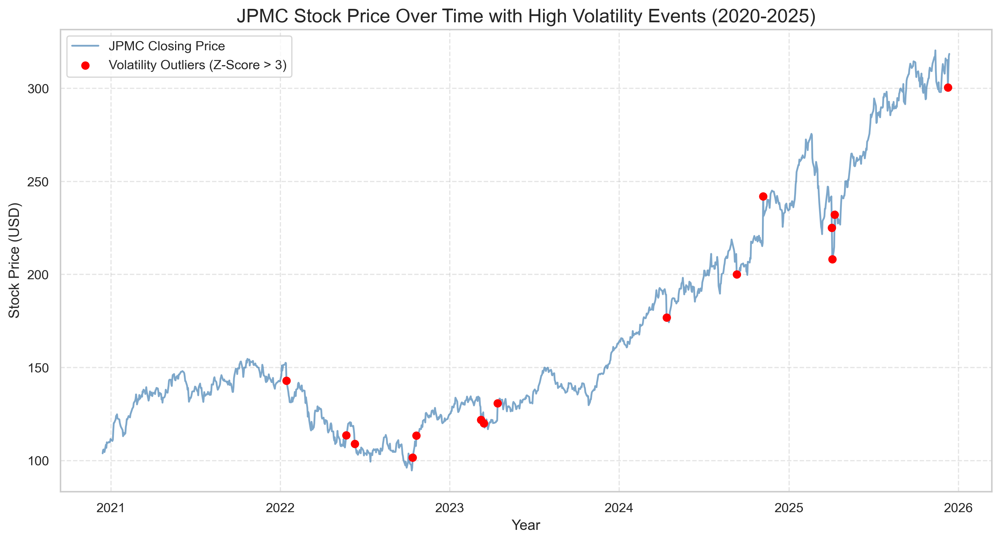
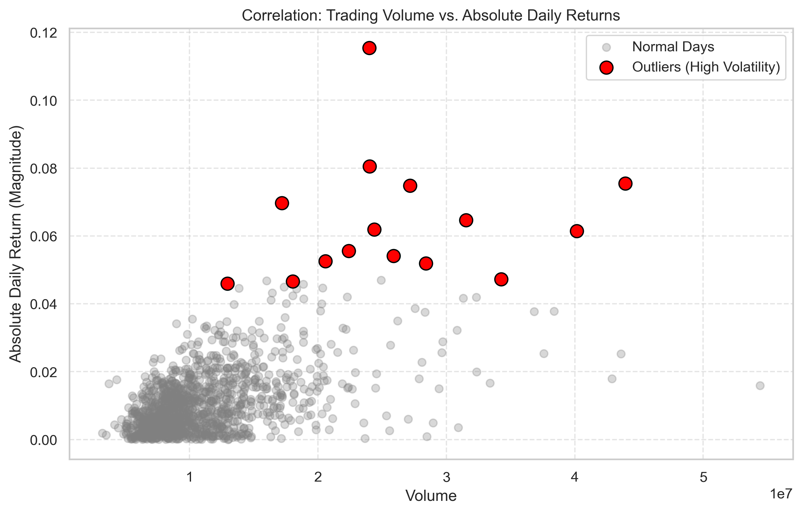
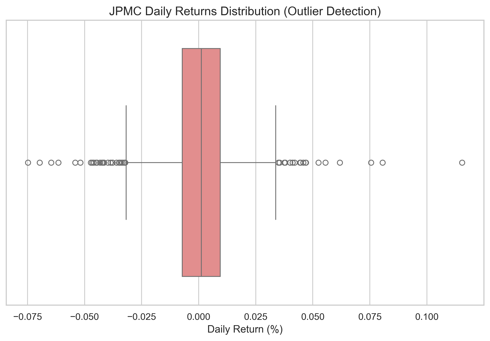

# JPMC Stock Risk Analysis (2020-2025)
**Author:** Socrates Gomes  
**Objective:** Identify systemic risk events and price anomalies in JPMorgan Chase & Co. stock using Z-Score statistical analysis.

## 🚀 Key Insights
* **Risk Events:** Identified 15 "Black Swan" events where volatility exceeded 3 standard deviations.
* **Historical Record:** The most extreme volatility spike occurred on **Nov 06, 2024**, with a daily return of **11.54%** and a Z-Score of **7.46**.
* **Market Validation:** Outlier days showed an average trading volume **2.39x higher** than normal days, confirming strong institutional participation.

## 📊 Visualizations

### 1. Risk Timeline
Mapping the 15 critical volatility events over the last 5 years.

### 2. Market Participation (Volume Validation)
Correlation between price shocks and trading volume spikes.

### 3. Statistical Distribution
Boxplot analysis showing the concentration of outliers in returns.

## 🛠️ Methodology & Tech Stack
* **Python (Pandas):** Data cleaning and time-series manipulation.
* **Z-Score Calculation:** Used to isolate events statistically rare (less than 0.3% probability).
* **Seaborn/Matplotlib:** High-resolution statistical data visualization.
* **Data Source:** JPMC Historical Data (Kaggle).